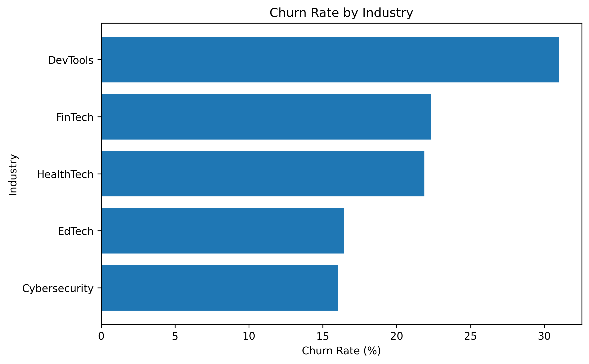
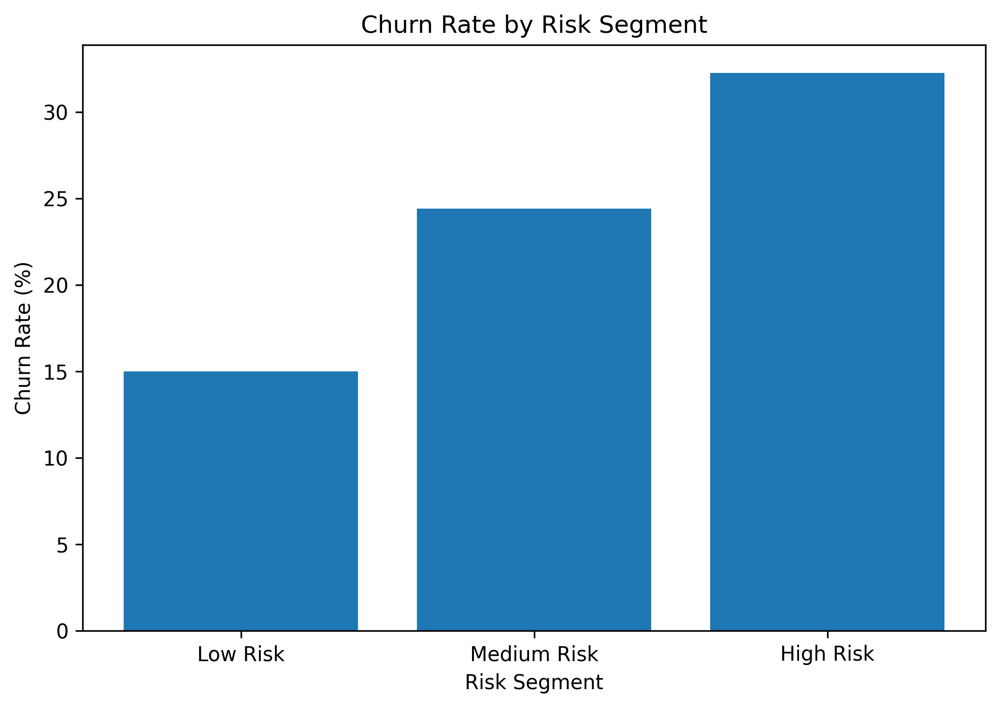
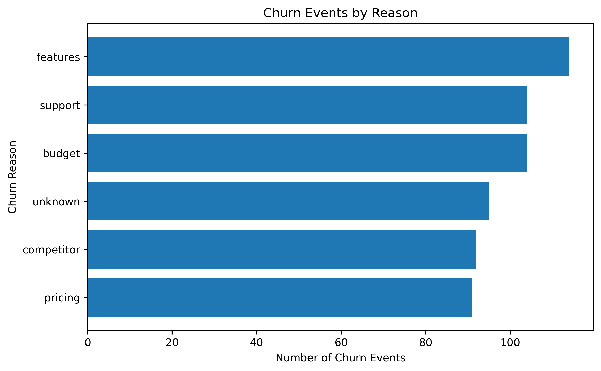

# Customer Churn Deep Dive + Action Plan

## Project Overview
A subscription-based SaaS company is experiencing customer churn and wants to understand why customers are leaving. This project analyzes customer churn patterns using SQL, Python, and Power BI-ready data to identify churn drivers, create customer risk segments, and recommend retention actions.

## Final Project Summary

This project found that churn is not mainly driven by plan tier or billing frequency. Instead, churn appears to be more connected to customer segment, trial status, support escalation, and product feature gaps.

The final churn risk segmentation model separated customers into low, medium, and high-risk groups. High-risk accounts had a churn rate of **32.26%**, compared to **15.00%** for low-risk accounts, making the model useful for prioritizing retention outreach.

## Business Problem
The company has an overall churn rate of **22%**. Leadership wants to understand:
- Which customer segments are churning the most?
- What behaviors or experiences are linked to churn?
- Which customers should be prioritized for retention?
- What actions can reduce churn?

## Tools Used
- SQL
- Python
- Pandas
- Matplotlib
- Jupyter Notebook
- GitHub

## Dataset
This project uses a SaaS churn dataset with the following tables:

- `accounts`
- `subscriptions`
- `feature_usage`
- `support_tickets`
- `churn_events`

The tables allow analysis across customer segments, subscription behavior, product usage, support experience, and churn reasons.

## Key Findings

### 1. Overall churn rate
The overall churn rate is **22%**, meaning about 1 in 5 customer accounts has churned.

### 2. Plan tier is not a major churn driver
Churn rates are almost identical across Basic, Pro, and Enterprise plans, all around **22%**.

### 3. DevTools customers are the highest-risk industry segment
DevTools customers have the highest churn rate at **30.97%**, significantly above the overall churn rate.

### 4. Germany has the highest churn rate, but small sample size
Germany has a churn rate of **32%**, but only 25 accounts, so this should be interpreted carefully.

### 5. Trial customers churn more
Trial customers churn at **25.77%**, compared to **21.09%** for non-trial customers.

### 6. Support escalations are a churn warning signal
Accounts with escalated support tickets churn at **25.27%**, compared to **21.27%** for accounts without escalations.

### 7. Missing features are the top churn reason
The most common churn reason is `features`, with **114 churn events** across **104 unique accounts**.

### 8. Risk segmentation creates a clear churn pattern
The customer risk model showed:

| Risk Segment | Churn Rate |
|---|---:|
| Low Risk | 15.00% |
| Medium Risk | 24.42% |
| High Risk | 32.26% |

This shows that combining multiple churn signals is more useful than analyzing each factor separately.

## Dashboard-Style Visualizations

### Churn by Industry


### Churn by Risk Segment


### Churn Reasons


Note: This project uses Python-generated dashboard-style visualizations instead of Power BI so the analysis remains reproducible across operating systems.

## Business Recommendations

Based on the churn analysis, the company should:

1. Prioritize DevTools customers for deeper retention analysis because they have the highest industry churn rate at **30.97%**.
2. Improve trial onboarding because trial customers churn at **25.77%**, compared to **21.09%** for non-trial customers.
3. Monitor support escalations as a churn warning signal because accounts with escalated tickets churn at **25.27%**.
4. Investigate product feature gaps because `features` is the most common churn reason, with **114 churn events**.
5. Use the churn risk segmentation model to prioritize high-risk accounts, which have a churn rate of **32.26%**.

## Churn Playbook

| Risk Segment | Trigger Signals | Recommended Action | Business Owner |
|---|---|---|---|
| Low Risk | No major warning signals | Continue standard lifecycle emails and product education | Marketing |
| Medium Risk | Trial user, support escalation, moderate product friction, or higher feature exploration | Send targeted onboarding tips, feature guidance, and check-in email | Customer Success |
| High Risk | DevTools customer, trial user, support escalation, high errors, or multiple risk signals | Assign customer success outreach, review support history, offer feature-specific guidance, and prioritize product feedback | Customer Success / Product |

## Project Structure

```text
customer-churn-deep-dive/
├── data/
│   ├── raw/
│   └── processed/
├── sql/
│   ├── 01_business_questions.sql
│   └── 02_churn_analysis_queries.sql
├── notebooks/
│   └── 01_data_inspection.ipynb
├── powerbi/
├── reports/
│   └── data_dictionary.md
├── images/
└── README.md

